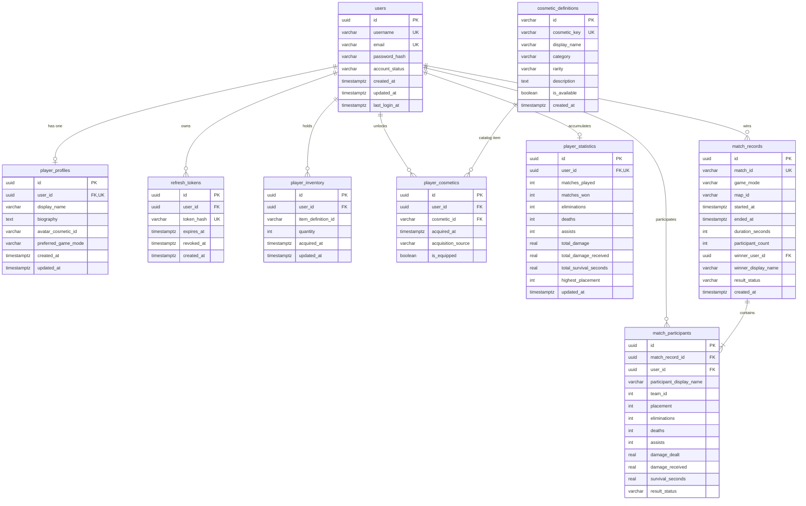

# Wildbound — Phase 43: Entity-Relationship Diagram

```mermaid
erDiagram
    users ||--o| player_profiles : "has one"
    users ||--o{ refresh_tokens : "owns"
    users ||--o{ player_inventory : "holds"
    users ||--o{ player_cosmetics : "unlocks"
    users ||--o| player_statistics : "accumulates"
    users ||--o{ match_records : "wins"
    users ||--o{ match_participants : "participates"

    cosmetic_definitions ||--o{ player_cosmetics : "catalog item"

    match_records ||--|{ match_participants : "contains"

    users {
        uuid id PK
        varchar username UK
        varchar email UK
        varchar password_hash
        varchar account_status
        timestamptz created_at
        timestamptz updated_at
        timestamptz last_login_at
    }

    player_profiles {
        uuid id PK
        uuid user_id FK,UK
        varchar display_name
        text biography
        varchar avatar_cosmetic_id
        varchar preferred_game_mode
        timestamptz created_at
        timestamptz updated_at
    }

    refresh_tokens {
        uuid id PK
        uuid user_id FK
        varchar token_hash UK
        timestamptz expires_at
        timestamptz revoked_at
        timestamptz created_at
    }

    player_inventory {
        uuid id PK
        uuid user_id FK
        varchar item_definition_id
        int quantity
        timestamptz acquired_at
        timestamptz updated_at
    }

    cosmetic_definitions {
        varchar id PK
        varchar cosmetic_key UK
        varchar display_name
        varchar category
        varchar rarity
        text description
        boolean is_available
        timestamptz created_at
    }

    player_cosmetics {
        uuid id PK
        uuid user_id FK
        varchar cosmetic_id FK
        timestamptz acquired_at
        varchar acquisition_source
        boolean is_equipped
    }

    match_records {
        uuid id PK
        varchar match_id UK
        varchar game_mode
        varchar map_id
        timestamptz started_at
        timestamptz ended_at
        int duration_seconds
        int participant_count
        uuid winner_user_id FK
        varchar winner_display_name
        varchar result_status
        timestamptz created_at
    }

    match_participants {
        uuid id PK
        uuid match_record_id FK
        uuid user_id FK
        varchar participant_display_name
        int team_id
        int placement
        int eliminations
        int deaths
        int assists
        real damage_dealt
        real damage_received
        real survival_seconds
        varchar result_status
    }

    player_statistics {
        uuid id PK
        uuid user_id FK,UK
        int matches_played
        int matches_won
        int eliminations
        int deaths
        int assists
        real total_damage
        real total_damage_received
        real total_survival_seconds
        int highest_placement
        timestamptz updated_at
    }
```

